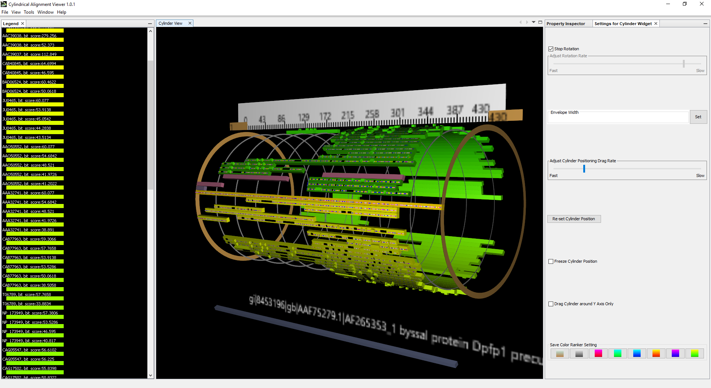
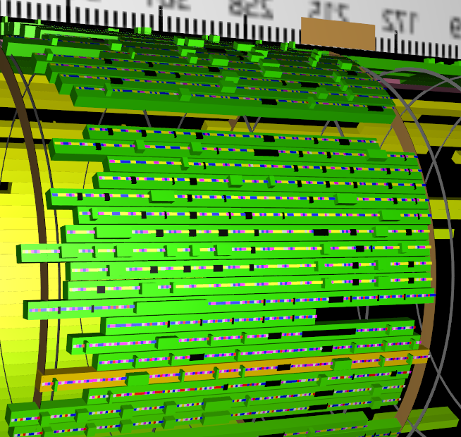
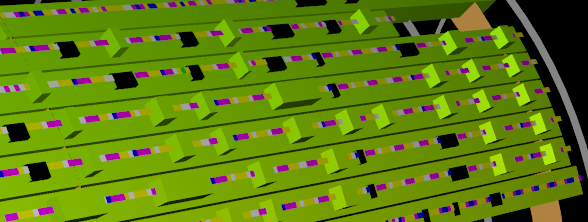
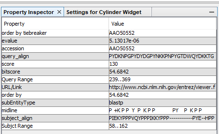
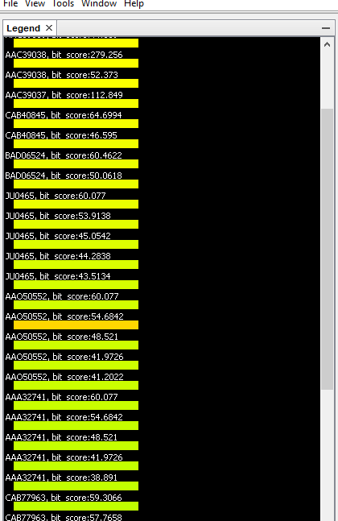

# Summary

Cylindrical Alignment App is a desktop application for examining Biomolecular
alignments such as would arise from running BLAST (Basic Local Alignment Search
Tool) written in the Java programming language.  It allows the user to open
variously formatted files of alignments to a common axis.  It presents the
alignments visually in 3-D as bar shapes arranged in a cylinder, such that
alignments are arranged along the "l" or long axis of the cylinder.  The result
is a barrel shape, which is animated by spinning around that axis.  The "axis of
alignment" (not to be confused with the axis of the cylinder) is depicted as a
separate, stationary shape in front of the cylinder and low enough not to
obstruct the view.  Above the spinning cylinder is a scale (ruler-like, with
lines telling unit counts from beginning to end of the axis of alignment.  The
cylinder is not solid, but rather has its alignments free-floating in space.

The shapes making up the cylinder outline start and end with respect to the axis
of alignment, and can be selected with mouse clicks.  When selected, properties
of those alignments may be seen in a subview.  An additional subview shows a
"legend" of color-vs-name.  Coloring is based on characteristics such as score
were applicable, or type where applicable.  In addition, the entire view may be
moved around with mouse drag gestures, and the spin animation may be stopped,
started, slowed or sped.

Since alignments may include deletions and insertions with respect to their axis
of alignment, those can be seen in alignments as either depressions in the
surface of the shape or additional floating shapes, respectively.  Additionally,
substitutions can be seen as smaller colored shapes alongside the overall
alignment shape.

The Cylindrical Alignment App is the successor of a previous viewer also written
by the author called the Cylindrical BLAST Viewer.

Main view with selection and controls.

Dentils are small color bars on the main bar, showing base coloring or Amino Acid characteristics.

Indels are displayed as pits for deletions or as floating boxes for insertions, w.r.t. the axis of alignment.

Properties are visible upon selection, so that users can drill-down to more detail.

The Legend sub view allows by clicking a named bar in a flat panel.

# Statement of Need

The purpose of the viewer is to provide researchers a means of examining how
large biomolecules (e.g., DNA, Amino Acid Chains, RNA) which have been
judged to have some relationship via alignment software, compare to each other.
Examples of "alignment software" include Basic Local Alignment Search Tool
(BLAST), ClustalW, and Gene Machine.  The display is highly visual, using
3D presentation, some animation and mouse interaction.  The 3D and interactive
aspects set this viewer apart from many others that are available.

Using this code to present alignments allows (up to a certain limit) more
alignments to be seen on the screen at one time than viewing them flat normally
does.  Having the alignments spinning allows users to see them flow past the eye
so that variations among the alignments may be seen easily.  Selecting shapes
allows some level of interaction, and since properties may include web links,
drilling down still further into interesting alignments is also possible, as are
indels and substitutions.

Researchers typically use this sort of visualization to inspect what their
automated tools (BLAST, etc.) have reported - particularly if many results
are returned.

# Related

The "MView" application is comparable.  http://desmid.github.io/mview/ .
Another viewer that could be used similarly might be MSA Reveal at
http://msareveal.org/index2.html. 

# Past Users

This project has been available on Source Forge at 
https://sourceforge.net/projects/cylindrical-alignment-app/ for the past three 
years and has been downloaded over 200 times.  Its predecessor was included in 
a larger project at Universiti Malaya in 2009
(https://github.com/choojun/mdg/wiki).

Visualization software for alignment of large biomolecules was used in
annotating the first Human Genome at Celera and NCBI--although not the software
described in this paper.  Screen shots of such software may be provided
in research papers as well.

Such visualizations may in addition be used to compare the efficacy of different
types of software in aligning sequences.  The alignments from one source
may be compared to alignments from other sources.  Thus, visualizing serves
as a means of software comparison.

# Acknowledgements

No financial support was given for this project.  Its predecessor's
functionality was reviewed by a group of three reviewers at Applied Biosystems
(now part of Thermo Fisher Scientific).  The predecessor "Cylindrical BLAST
Viewer" was created as a Master's degree project at Johns Hopkins
University, with supervision by Dr. Russell Turner.

# References
International Journal of Computer Science and Information Security (IJCSIS),
Vol. 14, No. 12, December 2016

